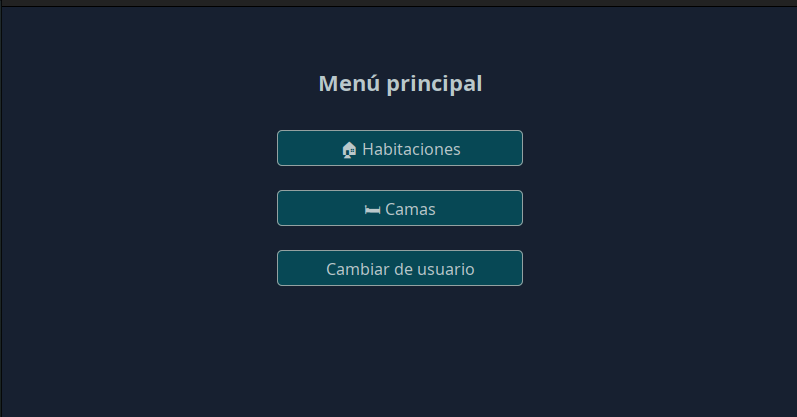
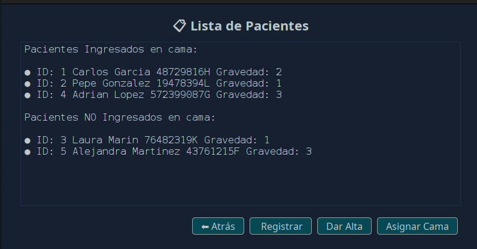
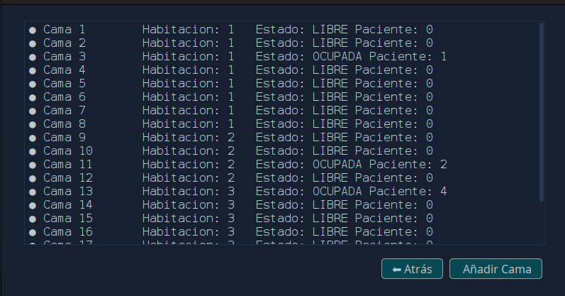
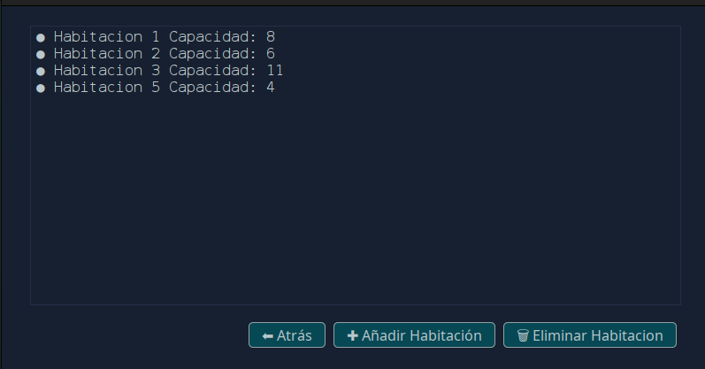

# 🏥 HospitalFlow

**HospitalFlow** is an application designed to simplify hospital bed management. It allows hospital administrators to efficiently monitor the availability of rooms, beds, and patients.

## 🚀 Main Features

- 📁 **Room Management**
  - Add new rooms
  - Remove empty rooms

- 🛏️ **Bed Management**
  - Add beds to a room
  - Mark beds as occupied or available

- 🧍‍♂️ **Patient Management**
  - Register a new patient
  - Assign a patient to an available bed
  - Discharge a patient (freeing the bed)

## 🧩 Technologies Used
- **Java** – Backend logic
- **Java Swing** – Graphical User Interface
- **MySQL** – Relational database

## 🖥️ Screenshots





## ⚙️ Installation and Running

Follow these steps to install and run the HospitalFlow application locally:

### 1. Clone the repository

```bash
git clone https://github.com/Hyzoor/HospitalFlow.git
```

### 2. Import the database
  - Open your MySQL database manager (e.g., MySQL Workbench, phpMyAdmin, or DBeaver).

  - Create a new database named hospitalflow.

  - Import the SQL file located at DDBB/hospital.sql.

### 3. Configure the database connection

Edit the `config.properties` file found in the config directory of the project. Make sure to enter your MySQL connection details correctly:

```properties
# Database URL (default port: 3306)
db.url=jdbc:mysql://localhost:3306/hospital

# MySQL username
db.user=your_username

# MySQL password
db.password=your_password
```

  ✅ Ensure the MySQL user has read and write permissions on the database.

### 4. Run the application
Option A: From your IDE (Eclipse, IntelliJ, NetBeans)

Option B: From the console
```bash
java -jar HospitalFlow.jar
```

  📝 Make sure you have Java (JDK 8 or higher) and MySQL installed and properly configured on your system.
## Requirements

[MySQL 8.0.27](https://downloads.mysql.com/archives/get/p/25/file/mysql-installer-web-community-8.0.27.1.msi)